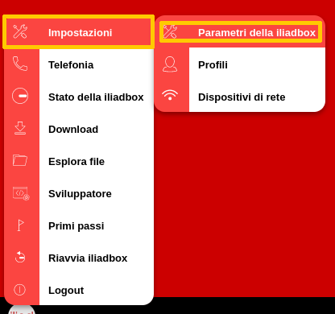
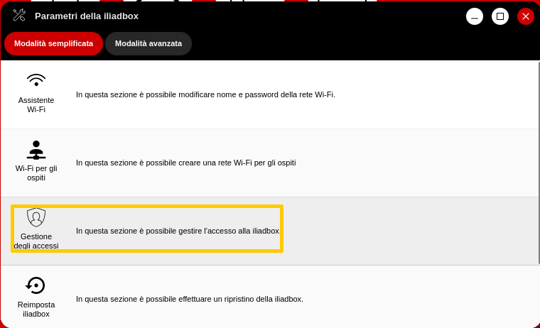
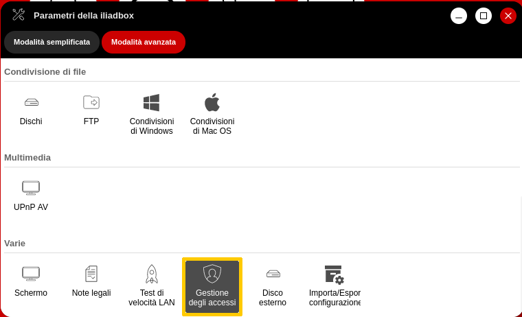
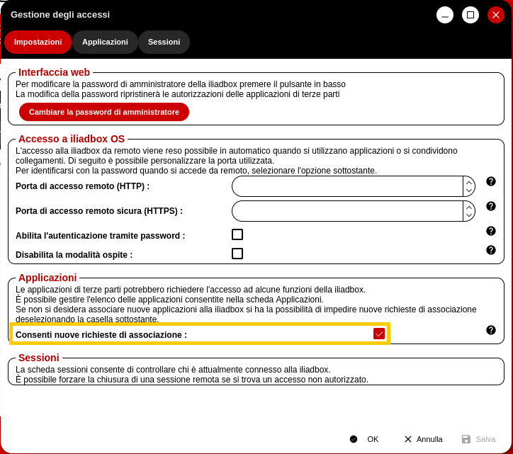
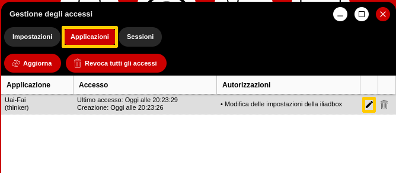
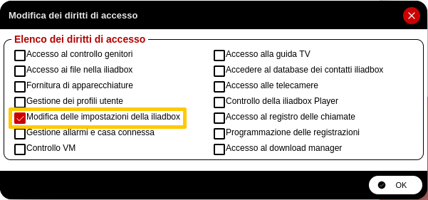

# Uai-Fai

A dirty but simple Python script to automagically create a guest password on an Iliadbox/Freebox router:

- depends on Python3 and the modules inside the `requirements.txt` file
- automatically registers an app token through the router's API
- uses plain HTTP for API requests
- prints the guest AP credentials as a QR-code inside the terminal

By default, the generated guest key will expire after one day; also, the description and the key itself are randomly generated.

## Installing and running

You can set up a Python virtualenv and use this script inside it through the following commands (in `Bash`):

```bash
python3 -m venv .venv
source .venv/bin/activate
python main.py
```

### Arguments

At the moment the script will accept the following arguments from the CLI:

- `-noqr`: will not print the QR-code to the terminal

## Enable the app pairing setting

**NOTE**: This setting should be ON by default, however it is a prerequisite to make the API calling work, therefore I am providing instructions on how to find it

Follow the pictures to find the app pairing setting, and enable it if is not checked:

1. Click on the bottom left menu, hover the mouse cursor over the "Settings" item, then click on "Iliadbox parameters"


2. In case you see the simplified view: click on the "Access management" item


3. In case you see the advanced view, scroll down and double-click on the "Access management" button


4. From the new window that will pop up, check the box at the right of the option "Allow new pairing requests"


## ⚠ Set the correct access rights for the token

**NOTE**: at the moment the "developper API" does not expose the `/authorization` endpoint, which you interact with through the web interface. Therefore, the following step is mandatory when running the script for the first time.

1. Follow the steps fem the previous section and open the "Access management" window

2. From there, click the "Applications" tab, then locate the "Uai-Fai" application and click the pencil icon at the right of its row


3. Select only the access right called "Edit Iliadbox/Freebox settings"


## Troubleshooting

To generate a new app token, delete the file `uaifai_authz.json` that the script will create after it's first run

The script will read from that file only the strings `app_token` and `track_id`, while it will obtain at runtime the `challenge` string.
